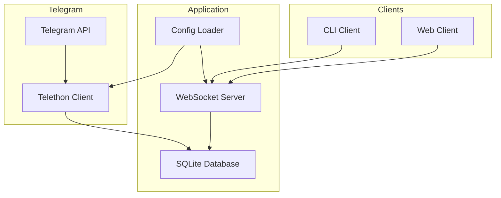
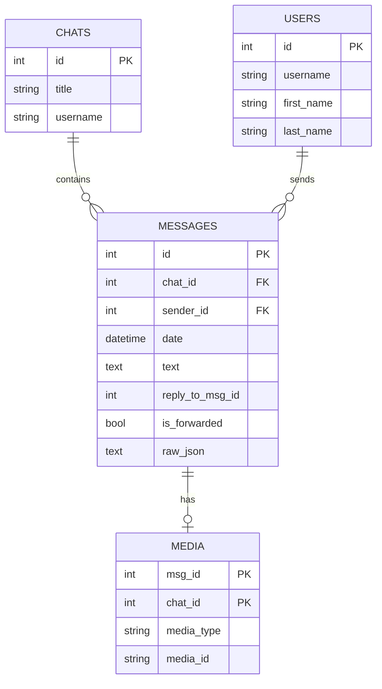

# Tele-Convo Project Plan

A Telegram message scraper with SQLite storage and JSON-RPC WebSocket interface.

## Project Overview

This project provides:
- **Telegram Integration**: Backfill historical messages and live-listen for new messages
- **SQLite Storage**: Normalized schema for users, chats, messages, and media
- **JSON-RPC WebSocket API**: Structured JSON responses with pagination and search capabilities

## Architecture



## Project Structure

```
tele-convo/
|-- .env.example          # Environment variables template
|-- .env                  # Actual environment variables (gitignored)
|-- .python-version       # Python version for uv
|-- pyproject.toml        # Project configuration and dependencies
|-- README.md             # Setup and usage documentation
|
|-- src/
|   |-- tele_convo/
|       |-- __init__.py
|       |-- config.py     # Environment-based configuration
|       |-- db.py         # Database operations
|       |-- telegram.py   # Telegram client operations
|       |-- server.py     # JSON-RPC WebSocket server
|       |-- main.py       # Application entry point
```

## Configuration (Environment Variables)

| Variable       | Description              | Required | Default            |
|----------------|--------------------------|----------|--------------------|
| `API_ID`       | Telegram API ID          | Yes      | -                  |
| `API_HASH`     | Telegram API Hash        | Yes      | -                  |
| `SESSION_NAME` | Telethon session name    | No       | `tele_convo`       |
| `GROUP_URL`    | Target group/channel URL | Yes      | -                  |
| `DB_PATH`      | SQLite database path     | No       | `data/messages.db` |
| `WS_HOST`      | WebSocket server host    | No       | `0.0.0.0`          |
| `WS_PORT`      | WebSocket server port    | No       | `8765`             |

## Database Schema

### ER Diagram



## JSON-RPC API Methods

### `getMessages`

Retrieve messages with pagination and filtering.

**Parameters:**
- `chat_id` (int, optional): Filter by chat ID
- `sender_id` (int, optional): Filter by sender ID
- `keyword` (string, optional): Search in message text
- `date_from` (string, optional): ISO date string for range start
- `date_to` (string, optional): ISO date string for range end
- `limit` (int, optional): Number of results (default: 50, max: 200)
- `cursor` (string, optional): Pagination cursor from previous response

**Response:**
```json
{
  "jsonrpc": "2.0",
  "result": {
    "messages": [...],
    "next_cursor": "base64_encoded_cursor",
    "has_more": true,
    "total_count": 150
  },
  "id": 1
}
```

### `getChats`

Retrieve all tracked chats.

**Response:**
```json
{
  "jsonrpc": "2.0",
  "result": {
    "chats": [
      {"id": 1, "title": "Group Name", "username": "groupusername"}
    ]
  },
  "id": 1
}
```

### `getUsers`

Retrieve users with optional filtering.

**Parameters:**
- `keyword` (string, optional): Search in username, first_name, last_name
- `limit` (int, optional): Number of results
- `cursor` (string, optional): Pagination cursor

### `getMedia`

Retrieve media records for messages.

**Parameters:**
- `chat_id` (int, optional): Filter by chat ID
- `media_type` (string, optional): Filter by type (photo, document)
- `limit` (int, optional): Number of results
- `cursor` (string, optional): Pagination cursor

### `search`

Full-text search across messages.

**Parameters:**
- `query` (string, required): Search query
- `date_from` (string, optional): ISO date string
- `date_to` (string, optional): ISO date string
- `limit` (int, optional): Number of results

## Pagination Strategy

Use cursor-based pagination with base64-encoded cursors containing:
- Last message ID
- Last date value
- Sort direction

```python
# Cursor structure (before base64 encoding)
{
  "last_id": 12345,
  "last_date": "2024-01-15T10:30:00+00:00"
}
```

## Implementation Details

### Dependencies

```toml
[project]
dependencies = [
    "telethon>=1.42.0",
    "websockets>=16.0",
    "python-dotenv>=1.2.1",
]

[project.optional-dependencies]
dev = [
    "pytest>=9.0.2",
    "pytest-asyncio>=1.3.0",
    "ruff>=0.15.1",
]
```

### Telethon Best Practices (Anti-Ban)

To avoid account deletion/limitation per [Telethon FAQ](https://docs.telethon.dev/en/stable/quick-references/faq.html#my-account-was-deleted-limited-when-using-the-library):

1. **Rate Limiting**
   - Add random delays between API requests (1-3 seconds)
   - Implement exponential backoff for retries
   ```python
   import random
   await asyncio.sleep(random.uniform(1, 3))
   ```

2. **FloodWaitError Handling**
   ```python
   from telethon import errors
   
   try:
       # telegram operation
   except errors.FloodWaitError as e:
       await asyncio.sleep(e.seconds)
   ```

3. **Logging**
   ```python
   import logging
   logging.basicConfig(
       format='[%(levelname)s %(asctime)s] %(name)s: %(message)s',
       level=logging.WARNING
   )
   ```

4. **Session Management**
   - Use unique session files per account
   - Never share sessions across scripts

5. **Backfill Strategy**
   - Fetch historical messages in chunks (e.g., 100 messages at a time)
   - Add delays between chunks
   - Don't fetch all messages at once

6. **Account Requirements**
   - Use well-established accounts (not newly created)
   - Avoid VoIP/virtual phone numbers

### Error Handling

JSON-RPC error codes:
- `-32700`: Parse error (invalid JSON)
- `-32600`: Invalid request
- `-32601`: Method not found
- `-32602`: Invalid params
- `-32603`: Internal error

Telegram-specific errors:
- `FloodWaitError`: Rate limited, wait required seconds
- `PeerFloodError`: Account limited, check @SpamBot

### Concurrency

- Use `asyncio` for async operations
- SQLite connections with WAL mode for better concurrency
- Connection pooling for WebSocket server

## Setup Instructions

1. **Clone and setup with uv:**
   ```bash
   cd tele-convo
   uv sync
   ```

2. **Configure environment:**
   ```bash
   cp .env.example .env
   # Edit .env with your Telegram API credentials
   ```

3. **Run the application:**
   ```bash
   uv run python -m tele_convo
   ```

4. **Connect via WebSocket:**
   ```python
   import websockets
   import json
   
   async def query():
       async with websockets.connect("ws://localhost:8765") as ws:
           request = {
               "jsonrpc": "2.0",
               "method": "getMessages",
               "params": {"limit": 10},
               "id": 1
           }
           await ws.send(json.dumps(request))
           response = await ws.recv()
           return json.loads(response)
   ```

## Next Steps

1. Initialize uv project with `uv init`
2. Create `.env.example` with all configuration variables
3. Implement configuration loader with `python-dotenv`
4. Implement database module with schema initialization
5. Implement Telegram client with backfill and live listening
6. Implement JSON-RPC WebSocket server
7. Create main entry point that orchestrates all components
8. Add comprehensive documentation in README.md
